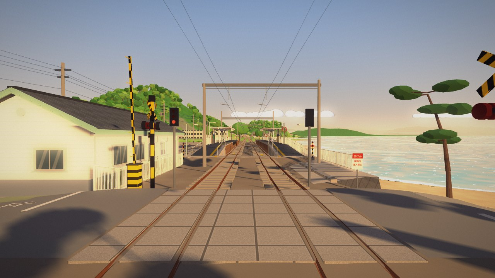
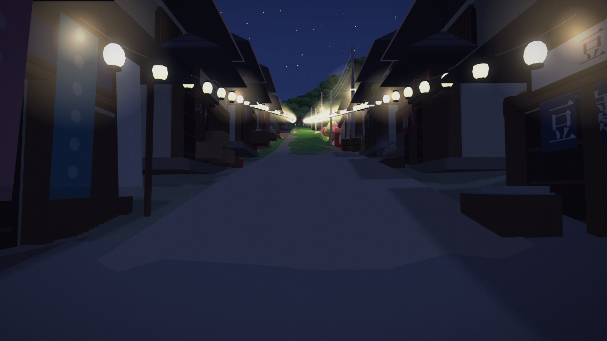

# 迎着阳光盛大逃亡 · A Grand Escape into the Sun

A fan tribute to *Dragon Raja* III (龙族, by Jiang Nan), Chapter 10. It is one day at **梅津寺 Baishinji** in Matsuyama,
rebuilt in 3D from real map and elevation data. It runs offline in the browser, on desktop and on phones.

**v0.1-alpha**, the first public build. What changed is in [`CHANGELOG.md`](CHANGELOG.md).

《龙族III》第十章「迎着阳光盛大逃亡」的同人致敬作品：路明非带着绘梨衣逃到松山梅津寺的那一天，
用真实地形与地图数据在浏览器里重建。离线运行，电脑和手机都能玩。

## Play
**Download this folder and double-click `index.html`.** It needs no server, no internet and no install. It also
works from GitHub Pages. If it runs slowly, open `index.html?lite`.

下载后双击 `index.html` 即可（无需服务器或网络）。如果卡顿，请打开 `index.html?lite`。

- **Story** (about 15 minutes): a guided, first-person walk through the chapter, from the empty lot at 17:30 to the
  last train at 21:45. Press Space (or tap) at the prompts, N (⏭) to skip a scene, Esc to leave.
- **Wander**: walk the town freely, at any time of day and in any weather.

| Desktop | Touch | Action |
|---|---|---|
| W A S D / arrows, Shift | left-thumb joystick (push fully to run) | walk / run |
| mouse drag, wheel | right-thumb drag | look, zoom |
| E | ✋ | sit (benches, the rock) / continue in the story |
| G | 📍 | go to a place |
| 1–4, T | 🌗 | time of day, time speed |
| R / F | ☔ / 🌫 | drizzle / sea fog |
| P, M, H | | photo mode, mute, help |

## What's in it
- **The real place.**
  - Terrain from the GSI 5 m elevation model (about 2 × 2 km), plus a 48 km far field with the Inland Sea islands.
  - Roads, buildings and the railway from OpenStreetMap.
  - The real sun and moon for Saturday, 27 April 2013.
- **The novel's places on the real hill:**
  - the empty lot with the red Porsche;
  - the shrine lane with its lanterns;
  - the hill tram, the stone jizo and the mine shrine;
  - the rock at the cliff where the sun sets into the sea;
  - the Ferris wheel that is no longer there.
- **The station, modelled in detail from photos:**
  - brick-faced platforms with tactile strips and white canopies;
  - the slate-roofed station house with its 「梅 津 寺 駅」 gable;
  - the level crossing with its concrete slabs, barriers and X-signals;
  - the diamond-grid sea wall and the beach steps;
  - mercury lamps whose light pools glint on the wet platform in the rain;
  - the orange Iyotetsu EMUs, and the D51 with its lit coaches.
- **No character models yet.** You see through Lu Mingfei's eyes. Erii is there through her notebook, her lines and
  what she leaves behind.
- **Subtitles** are in Chinese with English below. Lines spoken in Japanese in the scene (the shopkeeper, the
  station announcements, さよなら) stay in Japanese, with Chinese and English underneath.
- **Original music** and ambience, synthesized live with WebAudio.

| | |
|---|---|
|  |  |
|  |  |

## URL options
- `?story`, `?story&beat=5`: start the story (at a scene).
- `?start&at=station|platform1|lot|lane|shrine|summit|rock|wheel|beach&t=18.7&yaw=290&pitch=-5`: wander from a place,
  at an hour.
- `?stats`: frame rate, draw calls, triangles and the current resolution scale.
- `?lite`: half resolution and no shadows. `?nofx`: no post-processing. `?still`: render 3 frames and stop.
- `?cam=x,y,z&look=x,y,z&fov=50&photo`: a fixed camera for screenshots. `?scam=n,dy,s&slook=n,dy,s` does the same in
  station coordinates (n across the track, s along it, dy above the rail head).

## How it's made
- **three.js r149** is vendored in `lib/`. It is the last release with a non-module build, so the game uses plain
  `<script>` tags and no `fetch`, and it runs from `file://`.
- **Everything is generated in code:** models, textures, the sky, the sea and the sound. No images, models or
  recordings are downloaded or included.
- `js/` has one file per part of the world. `index.html` loads them in dependency order, and each file adds to the
  global `window.CITY`.

| File | Part |
|---|---|
| `util.js` | shared helpers: colliders, walkable decks, static-mesh merging |
| `data/*.js` | the preprocessed real data |
| `terrain.js` | the land, with the novel's edits baked into the height grid |
| `sky.js`, `sea.js`, `weather.js`, `postfx.js` | the sky and the real sun, the sea, rain and fog, the image look |
| `landmarks.js`, `trains.js`, `station.js`, `town.js`, `railway.js` | the models, the station, the town and the trains with their timetable |
| `audio.js`, `player.js`, `story.js`, `main.js` | music and sound, walking, the story, start-up and the frame loop |

- **Rebuilding the data.** `tools/` has the scripts that download the elevation tiles and the map and write
  `js/data/` (see [`tools/README.md`](tools/README.md)). You only need them to change the area.

## Status (v0.1-alpha)
This is an early build. It works from start to end, but some things are still to come:
- **No character models yet.** You see through Lu Mingfei's eyes.
- **Performance:** it needs a reasonably recent graphics card. On a slow computer, open `index.html?lite` (half
  resolution, no shadows), and `?stats` shows the frame rate.
- **Tested** in desktop Chrome. Other current browsers and phones should work, but haven't been checked on real
  devices yet.
- **Coming next:**
  - more detail around the station: the passenger crossing, the waiting room seen through the glass, and the
    platform clock, posters and speakers;
  - a denser, more varied town.

## Credits and licences
- Code: MIT. See [`LICENSE`](LICENSE).
- Third-party parts keep their own terms. See [`NOTICE.md`](NOTICE.md):
  - three.js r149 © 2010-2023 three.js authors (MIT);
  - map data © [OpenStreetMap](https://www.openstreetmap.org/copyright) contributors (ODbL 1.0). `js/data/osm.js` and
    `js/data/rail.js` are derived databases under the ODbL;
  - elevation: 出典：国土地理院 標高タイル（加工して作成）. The sea depth is invented.
- **Fan work:** non-commercial and unofficial. *Dragon Raja* (龙族) is by Jiang Nan (江南). Iyotetsu, Baishinji and
  the other real places and names belong to their owners. 本作为非商业同人作品，与原作及相关权利方无关。
